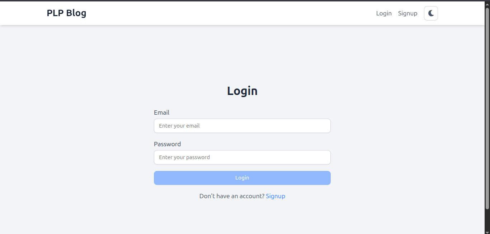
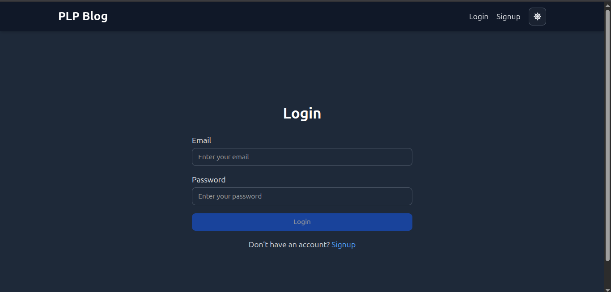
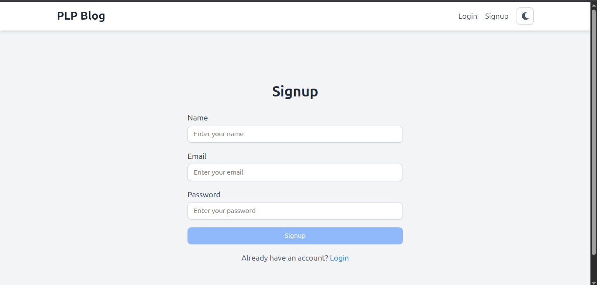
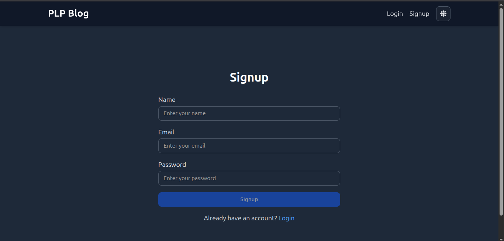
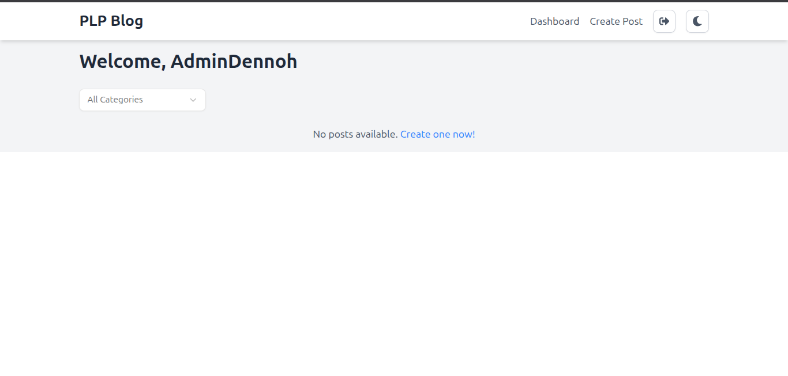
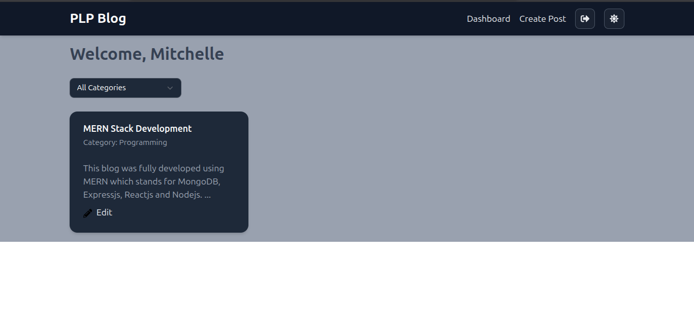
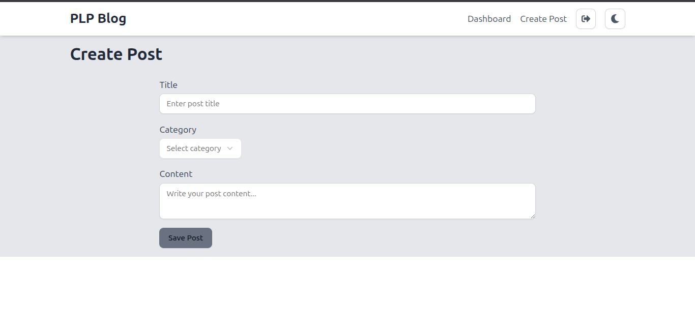
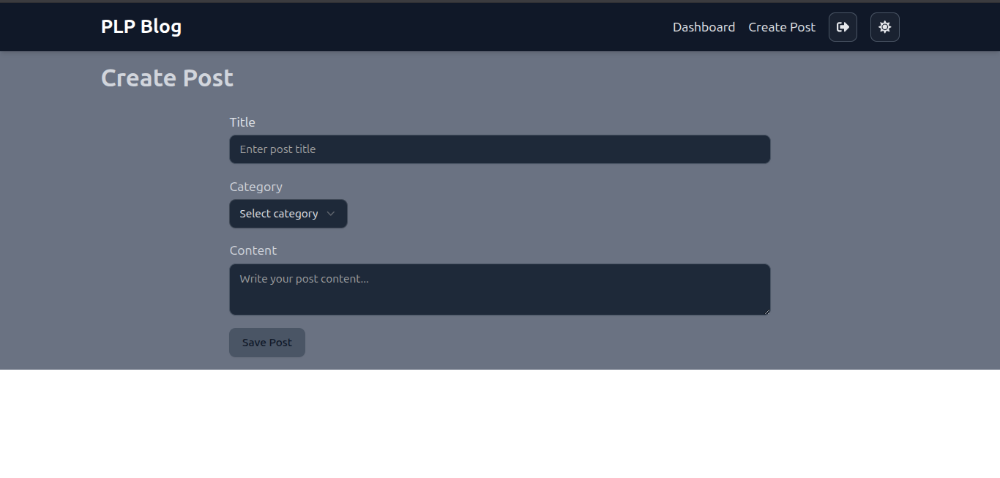

# MERN Blog Platform

A full-stack blog platform built with the MERN stack (MongoDB, Express, React, Node.js).  
Users can register, log in, create posts, comment, and manage categories. Admins have additional management features.

---

## Features

- User authentication (JWT-based)
- Create, edit, and delete blog posts
- Comment on posts
- Category management (admin only)
- Protected routes for users and admins
- Responsive UI with light/dark mode

---

## Tech Stack

- **Frontend:** React, Vite, Axios
- **Backend:** Node.js, Express, Mongoose
- **Database:** MongoDB
- **Authentication:** JWT, bcrypt

---

## Getting Started

### Prerequisites

- Node.js (v18+ recommended)
- pnpm (or npm/yarn)
- MongoDB (local or Atlas)

---

### 1. Clone the repository

```sh
git clone https://github.com/PLP-MERN-Stack-Development/week-4-mern-integration-assignment-endemic420.git
cd week-4-mern-integration-assignment-endemic420
```

---

### 2. Setup the Backend

```sh
cd server
cp .env.example .env   # or create .env as below
pnpm install
```

**.env example:**
```
MONGO_URI=mongodb://localhost:27017/blog
JWT_SECRET=your_jwt_secret
PORT=5000
```

Start the backend server:
```sh
pnpm run dev
```
The server runs on `http://localhost:5000`.

---

### 3. Setup the Frontend

```sh
cd ../client
cp .env.example .env   # or create .env as below
pnpm install
```

**.env example:**
```
VITE_API_URL=http://localhost:5000/api
```

Start the frontend:
```sh
pnpm run dev
```
The app runs on `http://localhost:5173` (or as shown in your terminal).

---

## Project Structure

```
server/
  controllers/
  middleware/
  models/
  routes/
  .env
  server.js

client/
  src/
    components/
    hooks/
    pages/
    services/
    App.jsx
  vite-env.d.ts
  .env
```

---

## Scripts

### Backend

- `pnpm run dev` — Start backend with nodemon

### Frontend

- `pnpm run dev` — Start React app with Vite

---

## API Endpoints

- `POST /api/auth/register` — Register user
- `POST /api/auth/login` — Login user
- `GET /api/posts` — Get all posts
- `POST /api/posts` — Create post (auth required)
- `PUT /api/posts/:id` — Edit post (auth required)
- `DELETE /api/posts/:id` — Delete post (auth required)
- `GET /api/categories` — Get all categories
- ...and more

---

## Screenshots

### Login page -Lightmode


### Login Page -Darkmode


### Signup Page -Lightmode


### Signup Page -Darkmode


### Dashboard Page -Lightmode


### Dashboard Page -Darkmode


### CreatePost Page -Lightmode


### CreatePost Dark -Darkmode



## License

MIT
---

## Author

- [Your Name](https://github.com/endemic420